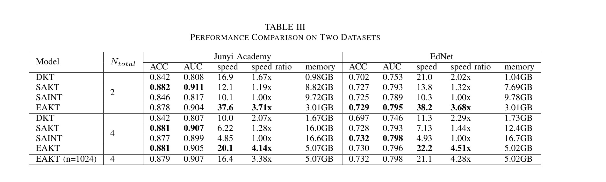

- ### Notes:

  - Different sequence length:

    - Short sequence(<=100): Rasch + BERT + RNN
    - Long sequence(>100): Rasch + BERT + RNN + last query + last answer
  - Different Rasch embedding:

    - IRT Rasch embedding is a fixed embedding, which means that the knowledge state of the student is fixed and does not change when estimated.
    - AKT Rasch embedding is a dynamic embedding, which means that the knowledge state of the student is updated when estimated.
  - Different RNN:

    - LSTM (Long Short-Term Memory) - it considers forgetting mechanism, which is more suitable for the knowledge state of the student
    - GRU (Gated Recurrent Unit) - it doesn't need memory units, so it is more suitable for short sequences. It considers more about the relationship between the current state and the previous state.
  - The last query and last answer are used to capture the context of the current question.
- ### Hyperparameters of the model:

  - Batch size: 64
  - Early stopping: 3 epochs. If the validation loss does not decrease for 3 epochs, the training will be stopped. It is used to prevent overfitting and save resources.
  - train/test split: 0.8/0.2
  - embedding size: 128
  - optimizer: Adam, learning rate: 0.001
  - Loss function: BCEWithLogitsLoss (Binary Cross Entropy with Logits Loss)
  - scheduler: OneCycleLR, max learning rate: 0.002
  - Dropout: 0.2
  - Epoch: 10
  - Others:

    - Max sequence length: 100
    - Attention head: 8
    - Hidden size: BERT: 128, FFN: 4 * 128 = 512, RNN: 128
    - Transformer Block/Encoder Layer: 12
- ### Model Architecture:

  In this paper, we propose a model architecture that combines the strengths of the BERT-based model with the Rasch model-based embeddings and a recurrent neural network (RNN) for the task of knowledge tracing in long sequences of data. The RNN used in this model is a long short-term memory (LSTM) unit, which is able to effectively utilize its internal memory to process and understand the relationships in long sequences of data.

  The Rasch model-based embeddings in this model consist of two components: difficulty embeddings and question embeddings. These are multiplied together and added to the BERT token embeddings, as well as the sin and cos positional embeddings, to create the final embeddings for the model. The segment embeddings, which typically represent information about the segment in the BERT model, are replaced by these Rasch embeddings in our proposed model. The Rasch embeddings are able to more accurately estimate the knowledge state of students, making them a key component in the effectiveness of our model for knowledge tracing tasks.

  The BERT model is well-known for its ability to effectively process and understand natural language text, and it has been shown to outperform other models in a variety of tasks. This is due in part to its large number of parameters, which allows it to capture a wide range of patterns and relationships in the data. It is also known for its ability to generate high-quality embeddings, which are crucial for many natural language processing tasks. The BERT-based portion of the model includes transformer blocks, which consist of several key components. The first is the multi-head attention mechanism, which uses the "Scaled Dot Product Attention" method as implemented in BERT. This attention mechanism also includes the use of "q," "k," and "v," as well as an attention mask for padded tokens. The second component is the feed forward network (FFN), which uses a feed-forward hidden layer with a size of four times the model's hidden size, and the GELU activation function rather than RELU. Finally, the sublayer connection in the transformer block includes a residual connection followed by a layer norm.

  In our proposed model, we choose to use a neural network (NN) linear transformation rather than the attention projection typically used in conjunction with the LSTM unit. This decision was based on the observed improved performance of the NN linear transformation in our experiments. It is not necessarily related to the length or complexity of the sequence, but rather the specific characteristics of the data and the task at hand. While our proposed model shares many similarities with the original BERT model used in natural language processing (NLP), it also differs in certain ways. For example, our model, called "LNBKT" (RNN BERT-based Knowledge Tracing model for Long Sequences Data), is specifically tailored for use in the field of knowledge tracing. This makes it particularly suitable for handling long sequences of data, a task for which the original BERT model may not be well-suited.

  Overall, our proposed model architecture combines the powerful natural language processing capabilities of the BERT model with the ability to accurately estimate knowledge states through the use of Rasch embeddings and the ability to effectively handle long sequences of data through the use of the LSTM unit and the NN linear transformation. This makes it an ideal choice for the task of knowledge tracing in long sequences of data.
- ### Results:
- We propose LNBKT, a novel Long-Sequences RNN BERT Knowledge Tracing, Which outperforms the baseline models on three traditional ITS datasets (assist12, assist17, algebra06). To the best of our knowledge, we are the first to introduce the combination of RNN and BERT into the Knowledge Tracing field.
- Comparative experiments on two large-scale datasets (\emph{EdNet} and \emph{Junyi Academy}) show the effectiveness process of the long-sequences dataset of LNBKT.

  - A table shows the acc and auc of different models on different datasets:

    - Models: BERT, BERT + RNN, BERT + Rasch, BERT + Rasch + RNN (Sequence length = 100)
    - Datasets: assist12, assist17, algebra06, EdNet, Junyi Academy

    <!-- Table (including acc and auc)-->

    |   Datasets   | Metrics |  BERT  | BERT + RNN | BERT + Rasch | BERT + Rasch + RNN |
    | :-------------: | :-------: | :------: | :----------: | :------------: | :------------------: |
    |   assist12   |   ACC   |       |           |             |                   |
    |               |   AUC   |       |           |             |                   |
    |   assist17   |   ACC   |       |           |             |                   |
    |               |   AUC   |       |           |             |                   |
    |   algebra06   |   ACC   |       |           |             |                   |
    |               |   AUC   |       |           |             |                   |
    |     EdNet     |   ACC   | 0.8087 |   0.7956   |    0.8100    |                   |
    |               |   AUC   | 0.8948 |   0.8773   |    0.8963    |                   |
    | Junyi Academy |   ACC   |       |           |             |                   |
    |               |   AUC   |       |           |             |                   |
  - A table shows the acc and auc of different models on different sequence length:

    - Models: BERT, BERT + RNN, BERT + RNN + Rasch
    - Sequence length: <=100, >100

    <!-- Table -->

    | Sequence length | Metrics | BERT | BERT + RNN | BERT + Rasch | BERT + Rasch + RNN |
    | :---------------: | :-------: | :----: | :----------: | :------------: | :------------------: |
    |      <=100      | Speed? |     |           |             |                   |
    |                 |         |     |           |             |                   |
    |      >100      |         |     |           |             |                   |
    |                 |         |     |           |             |                   |

  - Example performance table from which paper?:

    <!-- Table -->
    